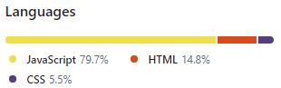

# 프로젝트 시작

# 2차 그린 프로젝트

## 프로젝트 기간 : 2024-06-19 ~ 2024-07-23

### 소모임 관리 앱

### 소개

- 2차 그린 프로젝트는 사용자가 모임을 개설하고 모임에 일정들을 쉽게 추적하고 가계부나 여러 부가기능으로 모임을 관리할 수 있도록 돕는 앱입니다.
   
- 현재는 기본적인 기능만 구현되어 있으며, 3차 프로젝트 이후 추가 기능 및 디자인 개선이 예정되어 있습니다.

https://github.com/user-attachments/assets/d2b512e6-63f1-4b12-a11d-ee13c1c8e731

### 사용 언어 및 라이브러리

 

<!--  -->

 

 

  
  
  

 

   

### 형상관리 도구

### BackEnd 협업 도구

### 사용언어 비율

### 사용 라이브러리

- react-icons
- react-calendar
- moment
- react-toastify

### 주요 기능

- **담당자 : 황운철**

  - **로그인**
    - 로그인 실패시 에러 메세지 제공
    - 로그아웃
  - **회원가입**
    - 이미지 추가 후 필요 데이터를 추가한 후 회원가입
    - 입력 필드 유효성 검사
  - ** 마이페이지 **
    - ** 유저 정보 수정 **
      - 비밀번호 변경
      - 회원탈퇴
      - 프로필 변경
      - 찜목록
       

- **담당자 : 윤성환**
  - **내모임 페이지**
    - 모임장 / 모임원 권한에 따라 조회
  - **일정관리**
    - 일정 등록 / 수정 / 삭제
      - 권한에 따라 조회 / 등록 수정 삭제 페이지 구분
    - 일정 신청(캘린더 / 리스트)
      - 일정 신청
      - 일정 신청 인원관리
      - 일정 참가
      - 일정 종료
        - 날짜에 따라서 등록
          - 수정 불가 일정 참가 불가
  - **가계부**
    - 가계부 등록 삭제
    - 가계부 내용 출력
  - **게시판 (3차)**
    - 게시판 조회 / 수정 /삭제 
    
     
- **담당자 : 박성호(팀장)**
  - **홈페이지**
  - **모임 페이지**
    - 모임생성 /수정 /삭제
    - 모임 찜
    - 모임 신청
  - **내모임 페이지**
    - 모임원 관리
    - 모임 신청서 관리
  - **관리자 페이지 (3차)**
    - 모임 생성 승인
  - **커뮤니티 후기**
    - 후기 추천하기
  - **후기작성 페이지**
  
